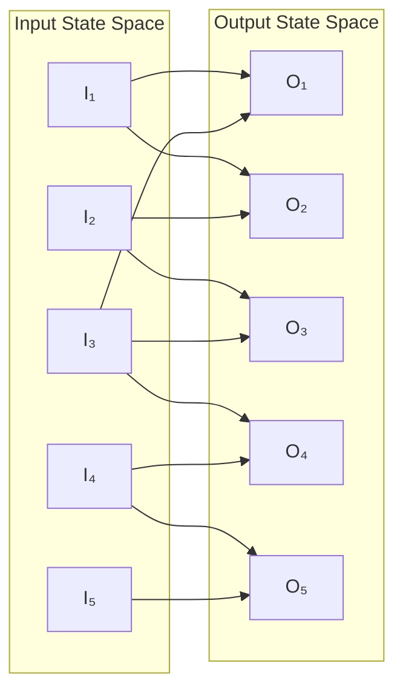
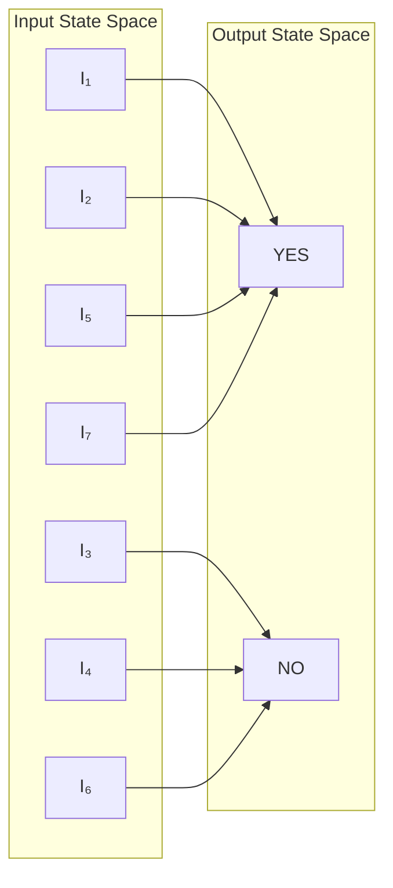
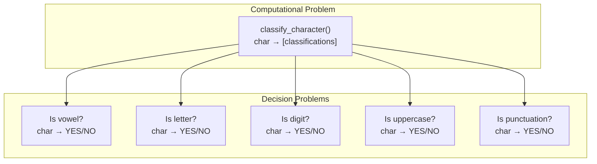
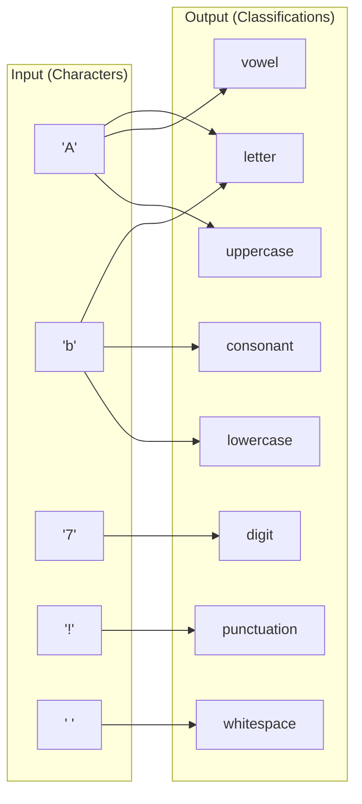
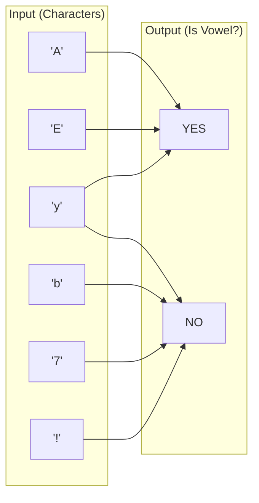

# Algorithm Introduction

**Week 1 - Thursday, Aug 28**  
**Exam Unit**: Exam1

## Overview

Problem-solving approaches and complexity basics

## Materials

CLRS Chapter 1-2

## Learning Objectives

- Understand computational problems and their input-output relationships
- Distinguish between general computational problems and decision problems
- Learn the fundamental properties of algorithms (correctness, efficiency, clarity, generality)
- Master time and space complexity analysis using the word-RAM computational model
- Apply best-case, average-case, and worst-case analysis to concrete algorithms
- Count fundamental operations in nested loops and complex control structures
- Develop problem-solving strategies using algorithmic paradigms

## What is an Algorithm?

An algorithm is a well-defined computational procedure that takes input and produces output. It's a sequence of computational steps that transform the input into the output.

### What is a Problem?

A computational problem defines a binary relation between an input state space and an output state space. Each valid input may correspond to one or more valid outputs, creating a many-to-many relationship.



The diagram illustrates how:

- Multiple inputs can map to the same output (I₁ and I₃ both map to O₁)
- A single input can have multiple valid outputs (I₃ maps to O₁, O₃, and O₄)
- A solution defines which input-output pairs are valid
- An algorithm must produce a valid output for each input

### Decision Problem

Later in this course we will discuss in-depth a special class of computational problems called **decision problems**. These problems have particularly simple output state space - they only require a yes/no answer. This creates an interesting contrast in state space sizes:



This diagram shows how decision problems work:

- **Large input space**: Complex objects like graphs, formulas, or data structures
- **Tiny output space**: Just two possible answers (YES/NO, True/False, 1/0)
- **Many-to-few mapping**: Many different inputs map to the same binary output

Examples of decision problems we'll encounter later:

- "Is this graph connected?" (Graph → YES/NO)
- "Does this graph have a Hamiltonian cycle?" (Graph → YES/NO)
- "Is this number prime?" (Integer → YES/NO)

### Problem Classification Examples

Understanding the distinction between general computational problems and decision problems is crucial for algorithm analysis. Let's explore this with a concrete example that demonstrates how multiple decision problems can overlap with a single computational problem.

#### Character Classification Problem

Consider the computational problem: "Given a character, classify it into its type(s)."

This represents a **general computational problem** because:

- **Input space**: All possible characters (letters, digits, punctuation, whitespace, etc.)
- **Output space**: Multiple possible classifications (vowel, consonant, digit, punctuation, whitespace, uppercase, lowercase, etc.)
- **Many-to-many mapping**: One character can belong to multiple categories

**Example Implementation**:

```python
def classify_character(char):
    classifications = []

    if char.isalpha():
        classifications.append("letter")
        if char.upper() in "AEIOU":
            classifications.append("vowel")
        else:
            classifications.append("consonant")

        if char.isupper():
            classifications.append("uppercase")
        else:
            classifications.append("lowercase")

    elif char.isdigit():
        classifications.append("digit")

    elif char.isspace():
        classifications.append("whitespace")

    else:
        classifications.append("punctuation")

    return classifications
```

**Output Examples**:

- `classify_character('A')` → `["letter", "vowel", "uppercase"]`
- `classify_character('b')` → `["letter", "consonant", "lowercase"]`
- `classify_character('7')` → `["digit"]`
- `classify_character('!')` → `["punctuation"]`

#### Multiple Decision Problems from One Classification

From this single computational problem, we can derive many **decision problems**:



Each decision problem extracts one specific yes/no answer from the general classification:

**Decision Problem Examples**:

```python
def is_vowel(char):
    return char.upper() in "AEIOU" and char.isalpha()

def is_digit(char):
    return char.isdigit()

def is_uppercase(char):
    return char.isupper()
```

#### State Space Comparison

**General Computational Problem**:

- **Input space size**: ~100,000+ Unicode characters
- **Output space size**: 2^7 = 128 possible combinations of classifications
- **Relationship**: Many-to-many (one input can map to multiple output types)



**Decision Problems**:

- **Input space size**: ~100,000+ Unicode characters (same as above)
- **Output space size**: 2 (YES/NO)
- **Relationship**: Many-to-few (many inputs map to same binary output)



#### Key Insights for Algorithm Design

**Computational Problems**:

- More complex output processing required
- May need to store and return multiple values
- Often build decision problems as components

**Decision Problems**:

- Simpler output processing (just return true/false)
- Can often be optimized for early termination
- Fundamental building blocks for more complex problems

**Relationship**:

- One computational problem often contains multiple decision problems
- Decision problems can be combined to solve computational problems
- Understanding both helps in choosing the right approach for analysis

This example demonstrates why algorithm analysis often focuses on decision problems - they're simpler to analyze while capturing the core computational difficulty of more complex problems.

### Properties of Algorithms

1. **Correctness**: Produces correct output for all valid inputs
2. **Efficiency**: Uses computational resources wisely
3. **Clarity**: Can be understood and implemented
4. **Generality**: Solves a class of problems, not just one instance

### Example: Same Parent Name - Are there any two students in class that share a parental first name?

```pseudocode
SameParentName(students[]):
    initialize empty array of parent names
    for each student in students:
        if student.parent1.name already in parent names:
            return true
        if student.parent2.name already in parent names:
            return true
        add student.parent1.name to parent names
        add student.parent2.name to parent names
    return false
```

Here we can imagine the students as a list of student objects with parent objects with name attributes for constant time lookup, or we can imagine it as asking the student the name of each of their parents.

```json
[
  {
    "name": "student1",
    "parent1": {
      "name": "Chris"
    },
    "parent2": {
      "name": "Peter"
    }
  },
  {
    "name": "student2",
    "parent1": {
      "name": "Gale"
    },
    "parent2": {
      "name": "Chris"
    }
  },
  ...
]
```

Given a predicate, an algorithm should find an input to verify the predicate. An input that is valid is a solution.

The predicate in this problem informally:

    does there exist a student_A in students that has a parent with a name that is equal to the name of some other student_B's parent in students

Formally:

    ∃s₁ ∈ S ∃s₂ ∈ S (s₁ ≠ s₂ ∧ ∃p₁ ∈ parents(s₁) ∃p₂ ∈ parents(s₂) (name(p₁) = name(p₂)))

An input solution for the predicate would be the student_A.parent# and student_B.parent# combination that has an equal name; the s₁, s₂, p₁, p₂ values formally (e.g. "student1", "student2", "Chris", "Chris").

1. Is this algorithm **correct**? Does it find a valid output for all inputs?
2. Is it **efficient**? Can we prove there is not a faster algorithm?
3. Is it **clear**? Can it be understood and implemented?
4. Does it solve the problem **generally**? Can it solve a class of problems, not just one instance?

### Why Analyze Algorithms?

- Predict performance before implementation
- Compare different solutions to the same problem
- Identify bottlenecks and optimization opportunities
- Understand scalability limitations

## Analysis

### Efficiency

To measure the efficiency of an algorithm we could simply 'time' the computer. More time to reach a solution means less efficiency. However this would depend on the strength of the underlying computer, we want to abstract this variability away during analysis.

We will abstract this problem away by considering the only _fundamental operations_ of the algorithm.

We make the assumption that each computer performs these _fundamental operations_ in the same amount of time. We call this **constant time**.

To analyze the efficiency of an algorithm, we will measure the number of operations not the time.

We will use _asymptotic analysis_ in this class to compare the growth of the number of _fundamental operations_ as the input size grows.

But what is a _fundamental operation_?

### Computational Model

The **word-RAM (Random Access Machine)** model is our theoretical foundation for algorithm analysis. Understanding this model helps us determine what operations are "fundamental" and take constant time.

#### Memory Architecture

Computers store data in single byte memory blocks, each addressed with 64-bit (8-byte) identifiers. Think of this like a massive postal system:

**ZIP Code Analogy**: Imagine if every house in the world had its own unique ZIP code. With 64-bit addressing, we have 2^64 possible addresses - enough unique "ZIP codes" for 18 quintillion memory locations!

**Q1:** What's the RAM limit for 64-bit architecture?

**A:**

**Example calculation**: If each ZIP code were a house and we had 10^5 = 100,000 different 5-digit ZIP codes, we could address 100,000 houses. With 64 bits, we can "address" 2^64 different memory locations.

#### 64-bit Architecture Implications

With 64-bit addressing:

- **Pointer size**: Each memory address requires 64 bits (8 bytes)
- **Integer arithmetic**: Native support for 64-bit integers in O(1) time
- **Memory layout**: Data structures must account for 8-byte address alignment

#### Fundamental Operations (O(1) Time)

Computers operate with a system clock where each cycle can perform these _fundamental operations_:

**Memory Operations**:

- `read` a single word from memory at address `addr`
- `write` a single word to memory at address `addr`
- Basic pointer arithmetic: `addr + offset`

**Arithmetic Operations on Loaded Words**:

- Integer arithmetic: `+`, `-`, `*`, `/`, `%` (on fixed-size integers)
- Comparison operations: `<`, `>`, `==`, `!=`, `<=`, `>=`
- Logical operations: `AND`, `OR`, `NOT`, `XOR`
- Bitwise operations: `&`, `|`, `~`, `^`, `<<`, `>>`

**Control Flow**:

- Conditional branches: `if`, `goto`
- Function calls (assuming O(1) parameters)

#### Operations That Are NOT O(1)

It's crucial to understand what operations require more than constant time:

**String Operations**:

- String comparison: O(length of string)
- String concatenation: O(total length)
- String search: O(string length)

**Big Integer Arithmetic**:

- Adding numbers larger than 64 bits: O(number of digits)
- Multiplication of large numbers: O(digits²) or better with advanced algorithms

**Dynamic Memory Management**:

- `malloc`/`new`: May require O(log n) or worse depending on implementation
- `free`/`delete`: May require O(log n) time for garbage collection

**High-level Language Features**:

- Python list operations like `list.append()` (usually O(1) but occasionally O(n))
- Dictionary operations in worst case: O(n) due to hash collisions
- Set operations: May not be O(1) in worst case

#### Practical Memory Limits vs Theoretical

**Theoretical**: 2^64 = 18,446,744,073,709,551,616 bytes ≈ 18 exabytes

**Practical Constraints**:

- **Operating System**: Windows 10 Home supports max 128 GB RAM
- **Hardware**: Consumer motherboards typically support 64-128 GB
- **Cost**: High-end systems rarely exceed 1 TB RAM
- **Virtual Memory**: OS can simulate more RAM using disk storage (much slower)

#### Programming Language Implications

**Python Example Issues**:

```python
# These may NOT be O(1) operations!
my_set.add(item)        # Usually O(1), but O(n) in worst case
my_dict[key] = value    # Usually O(1), but O(n) in worst case
my_list.append(item)    # Usually O(1), but O(n) when resizing
```

**Safe O(1) Operations in Most Languages**:

```python
x = arr[i]              # Array indexing
x + y                   # Arithmetic on native integers
x == y                  # Comparison of native types
if condition:           # Conditional branching
```

This model helps us focus on algorithm structure rather than implementation details when analyzing complexity.

### Time Complexity

Measures how running time increases with input size.

```python
# Example: Linear Search
def linear_search(arr, target):
    for i in range(len(arr)):  # Executes n times
        if arr[i] == target:    # Comparison: constant time
            return i            # Return: constant time
    return -1                   # Return: constant time
```

Time Complexity: O(n) where n is the array length

### Space Complexity

Measures memory usage as a function of input size.

```python
# Example: Creating a multiplication table
def multiplication_table(n):
    table = [[0] * n for _ in range(n)]  # Space: n²
    for i in range(n):
        for j in range(n):
            table[i][j] = i * j
    return table
```

Space Complexity: O(n²) where n is an input number

### Best, Average, and Worst Case

Consider searching for an element:

- **Best Case**: Element is first - O(1)
- **Average Case**: Element is in middle - O(n/2) = O(n)
- **Worst Case**: Element is last or not present - O(n)

We typically focus on **worst-case** analysis because:

1. Provides upper bound guarantee
2. Average case often difficult to calculate as we'll see in Exam1/03_AsymptoticNotation.md
3. Worst case might occur frequently in practice

Remember that for best & worst case analysis you must consider all input sizes. Just because n can be 1 does not mean an algorithms best case running time is always O(1)

We can only 'pick specific conditions' for the best and worst cases on structure of an unbounded input.

In the best case, all the below problems have algorithms that are O(n) not O(1). There is no way to find a solution in constant time for any 'best case' input with a large n.

- Which student is the youngest?

- Which integer in an array is the largest?

- Are there more 4's than 3's in an array of integers?

### Worst Case Operation Counting

#### Example: Nested Loops

```python
def print_pairs(arr):
    n = len(arr)
    count = 0
    for i in range(n):         # Outer loop: n iterations
        for j in range(i+1, n): # Inner loop: (n-i-1) iterations
            print(arr[i], arr[j])
            count += 1
    return count
```

Total operations:

- When i=0: n-1 operations
- When i=1: n-2 operations
- ...
- When i=n-2: 1 operation
- Total: (n-1) + (n-2) + ... + 1 = n(n-1)/2 = O(n²)

## Mathematical Foundations

Before diving deeper into algorithm analysis, we need to establish the mathematical tools that will help us analyze algorithms precisely. These concepts from discrete mathematics, algebra, and number theory are essential for understanding complexity analysis.

### Series and Summations

Many algorithms involve nested loops or recursive structures that require us to sum sequences of numbers. Understanding these fundamental summation formulas is crucial for complexity analysis.

#### Triangular Numbers

The sum of the first n positive integers:

```
∑(i=1 to n) i = 1 + 2 + 3 + ... + n = n(n+1)/2
```

**Example**: If we have nested loops where the inner loop runs from 0 to i:

```python
count = 0
for i in range(n):
    for j in range(i+1):  # runs i+1 times
        count += 1        # total: 1 + 2 + 3 + ... + n = n(n+1)/2
```

#### Sum of First n Odd Numbers

```
∑(i=1 to n) (2i-1) = 1 + 3 + 5 + ... + (2n-1) = n²
```

**Example**: This appears in algorithms that process odd-positioned elements:

```python
total = 0
for i in range(1, n+1):
    total += 2*i - 1  # Sum equals n²
```

#### Sum of First n Even Numbers

```
∑(i=1 to n) 2i = 2 + 4 + 6 + ... + 2n = n(n+1)
```

#### Geometric Series

For a geometric series with first term 1 and common ratio r ≠ 1:

```
∑(i=0 to n-1) r^i = 1 + r + r² + ... + r^(n-1) = (r^n - 1)/(r - 1)
```

**Special case**: When r = 2 (powers of 2):

```
∑(i=0 to n-1) 2^i = 1 + 2 + 4 + 8 + ... + 2^(n-1) = 2^n - 1
```

This is fundamental in analyzing binary trees and divide-and-conquer algorithms.

#### Sum of Squares

```
∑(i=1 to n) i² = 1² + 2² + 3² + ... + n² = n(n+1)(2n+1)/6
```

**Practice Example**: Analyze this nested loop structure:

```python
def complex_nested(n):
    count = 0
    for i in range(1, n+1):      # i from 1 to n
        for j in range(i*i):     # j from 0 to i²-1
            count += 1
    return count
```

**Solution**: The inner loop runs i² times for each i, so:
Total operations = ∑(i=1 to n) i² = n(n+1)(2n+1)/6 = O(n³)

### Logarithms and Exponents

Logarithms appear frequently in algorithm analysis, especially for divide-and-conquer algorithms and tree-based data structures.

#### Change of Base Formula

```
log_a(n) = log_b(n) / log_b(a)
```

This means all logarithms differ only by a constant factor, so in asymptotic analysis:
log₂(n) = O(log₁₀(n)) = O(ln(n)) = O(log_k(n)) for any k > 1

#### Essential Logarithm Rules

1. **Product Rule**: log(ab) = log(a) + log(b)
2. **Quotient Rule**: log(a/b) = log(a) - log(b)
3. **Power Rule**: log(a^b) = b·log(a)
4. **Change of Base**: log_a(b) = log_c(b)/log_c(a)

#### Connection to Binary Search

The most intuitive way to understand log₂(n) in computer science:

**log₂(n) = "How many times can you divide n by 2 before reaching 1?"**

```python
def count_divisions(n):
    count = 0
    while n > 1:
        n = n // 2
        count += 1
    return count  # This returns ⌊log₂(n)⌋
```

This explains why binary search has O(log n) time complexity - each comparison eliminates half the remaining elements.

#### Tree Heights

In a balanced binary tree with n nodes:

- Height = O(log n)
- Each level can hold at most 2^h nodes
- Total nodes in complete tree of height h: 2^(h+1) - 1

### Number Theory Basics

Combinatorics helps us analyze algorithms that generate or process combinations and permutations of data.

#### Permutations

The number of ways to arrange r objects from n distinct objects where **order matters**:

```
P(n,r) = n!/(n-r)!
```

**Also written as**: "n permute r" or "n P r"

**When to use**: Arranging elements, generating ordered sequences

**Example**: How many ways can we arrange 3 students from a class of 10?
P(10,3) = 10!/(10-3)! = 10!/7! = 10 × 9 × 8 = 720

#### Combinations

The number of ways to choose r objects from n distinct objects where **order doesn't matter**:

```
C(n,r) = n!/[r!(n-r)!]
```

**Also written as**: "n choose r" or "n C r" or (n r)

**When to use**: Selecting subsets, grouping problems

**Example**: How many ways can we choose 3 students from a class of 10?
C(10,3) = 10!/(3! × 7!) = (10 × 9 × 8)/(3 × 2 × 1) = 120

#### Pascal's Triangle and Pascal's Identity

Pascal's Identity: C(n,r) = C(n-1,r-1) + C(n-1,r)

```
Row 0:           1
Row 1:         1   1
Row 2:       1   2   1
Row 3:     1   3   3   1
Row 4:   1   4   6   4   1
Row 5: 1   5  10  10   5   1
```

Each number is C(n,r) where n is the row and r is the position (starting from 0).

**Algorithmic Application**: This identity is the basis for dynamic programming solutions to combination problems.

#### Decision Tree: When to Use Each

**Use Permutations P(n,r) when**:

- Order matters
- Arranging objects in sequence
- Password generation (if repetition matters)

**Use Combinations C(n,r) when**:

- Order doesn't matter
- Selecting teams or groups
- Choosing subset of features

## Correctness

We'll have limited exposure to proving correctness but will require informal justifications for pseudocode solutions. Understanding correctness proofs helps us verify that our algorithms actually solve the problems they claim to solve.

## Practice Problems

**Q2:** Count Operations: How many times does the print statement execute?

```python
for i in range(n):
    for j in range(n):
        for k in range(n):
            print(i, j, k)
```

**A:**

**Q3:** Space Analysis: What's the space complexity?

```python
def create_matrix(n):
    return [[i+j for j in range(n)] for i in range(n)]
```

**A:**

**Q4:** Analyze this function's best/worst running time:

```python
def contains_duplicate(arr):
    for i in range(len(arr)):
        for j in range(i+1, len(arr)):
            if arr[i] == arr[j]:
                return True
    return False
```

**A:**

**Q5:** What is the running time of 'Same Parent Name' algorithm on a student array of size n (assume brute force search for parent names array search)?

**A:**

## Solving Algorithms Problems

To solve problems in this class:

1. reduce to the solution of another problem we already know how to solve
   - Sorting, BFS/DFS, BST, Heap
2. design our own algorithm using an applicable algorithmic paradigm
   - Divide & Conquer, Greedy or Dynamic Programming

## Key Takeaways

- Computational problems define many-to-many relationships between input and output state spaces
- Decision problems have binary output spaces but potentially large input spaces
- Algorithm analysis abstracts hardware differences by counting fundamental operations
- The word-RAM model provides a foundation for understanding what constitutes a constant-time operation
- Worst-case analysis provides upper bound guarantees and is often the most practical measure
- Time complexity measures operation count growth; space complexity measures memory usage growth
- Nested loop analysis requires careful counting of iterations at each level
- Two main problem-solving approaches: reduce to known problems or apply algorithmic paradigms

## Next Lesson

We'll apply these algorithms analysis concepts to peak finding

---

_Course content developed by Declan Gray-Mullen for WNEU with Claude_
